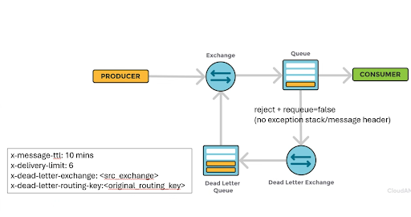

# DEMO: RabbitMQ delayed retry loop with limit of 6 sample

See the `src/main/java/DelayedRetry.java`.
Creates a delayed retry strategy for a consumer with customizable:
- Queue name
- Queue type
- Number of retries
- Interval between retries
## Running the Demo

```shell
# terminal tab 1, run the Sender:
gradle -Pmain=Send run

# terminal tab 2, run the Receiver:
gradle -Pmain=Recv run

```

