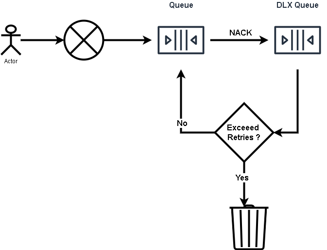

# DEMO: RabbitMQ delayed retry loop with limit of 10 sample

Creates a loop where a NACKed message is retried 6 times with a delay 5 seconds beteen retries

```shell
# terminal tab 1
gradle -Pmain=Recv run

# terminal tab 2
gradle -Pmain=Send run
```

